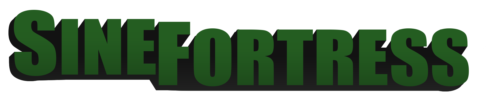

# Sine Fortress
Sine Fortress is a Team Fortress 2 Sourcemod set in the 90's with more variety in environments, themes, and two new classes. Existing classes and their roles will stay mostly the same but with alternatives focused on being new weapons rather than stat-swaps, with the additional classes focused on filling new roles and niches over recreating existing sub-classes and gameplay styles present in Live TF2. 

Aesthetically, Sine Fortress wants to follow the corporate themes of TF2, albeit moving away from the heavy focus on dust bowls and gravel pits. We want to explore the new kinds of companies that can exist in a 90's era interpretation of TF2, focusing on more urban and corporate environments. Respawn areas are less generic locker rooms and more furnished breakrooms, security offices in malls, and spaces that a professional in the 90s could typically find themselves in.

On the creation side of things, we want to provide tools and assets for mapmakers to create maps unique to Sine, allowing gameplay and story-telling possibilities that cannot be realized in Live TF2 without significant compromise. We are aiming to provide a framework with options like RGB team colors, unique environments, and wildly different gameplay mechanics and game modes that would not be achievable in Live TF2 and would be unique to our mod as a focus.

## Legal

Valve, the Valve logo, Steam, the Steam logo, Team Fortress, the Team Fortress logo, Source, the Source logo are trademarks and/or registered trademarks of Valve Corporation in the U.S. and/or other countries.

Sine Fortress is not sponsored, endorsed, licensed by, or affiliated with Valve Corporation.
